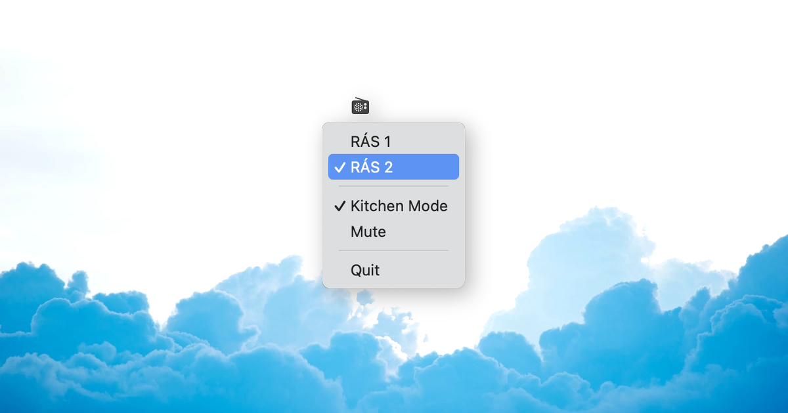

<p align="center">
  
</p>

<h1 align="center">RÚV Noise</h1>
<p align="center">Icelandic public radio through a warm tube amp in your menubar</p>

---

A tiny macOS menubar app that streams RÁS 1 and RÁS 2 with a lo-fi analog processing chain. Great for background noise while you work.

## The Sound

Three modes — switch from the menubar:

### Lo-Fi (default)

Warm vintage tube radio. The audio runs through a real-time DSP pipeline:

- **Band shaping** — HP 200 Hz / LP 4.5 kHz with +6 dB mid-range presence at 2 kHz
- **Tube saturation** — Two cascaded asymmetric triode stages with even harmonic exciter
- **Tape coloring** — Pre/de-emphasis around the saturation for natural HF compression
- **Soft compression** — RMS-based soft-knee compressor (slow attack, tube-like squish)
- **FM detuning** — Slow volume drift, pilot tone flutter, faint mains hum — like being 0.5% off the wavelength
- **Analog noise** — Pink noise floor + sparse vinyl crackle
- **Mono collapse** — Stereo → mono, like a single-speaker radio

### Kitchen Mode

Radio in the other room. Two-stage spatial simulation:

1. **Eldhús** — Small kitchen reverb (8ms, high feedback), standing wave resonance at 600 Hz
2. **Doorway** — Low-pass at 1.2 kHz as sound passes through the door
3. **Stofa** — Larger living room reverb (25ms, moderate feedback), room color at 250 Hz
4. **Distance** — -6 dB attenuation, noise becomes relatively prominent

### Clean

Bypass all processing. Pure HLS stream for A/B comparison.

## Features

- Auto-tune for RÁS 1 news broadcasts (fetches schedule from RÚV GraphQL API)
- Measures actual HLS live latency for precise auto-play timing

## Build

```
open RuvNoise.xcodeproj
# ⌘R to run, or:
xcodebuild -scheme RuvNoise -configuration Release
```

Requires macOS 14+ and Xcode 15+.

## Streams

| Station | URL |
|---------|-----|
| RÁS 1  | `https://ruv-radio-live.akamaized.net/streymi/ras1/ras1.m3u8` |
| RÁS 2  | `https://ruv-radio-live.akamaized.net/streymi/ras2/ras2.m3u8` |

## Tech

- Swift + SwiftUI `MenuBarExtra` (no dock icon)
- Manual HLS segment fetching + `AVAudioEngine` for real-time DSP
- vDSP/Accelerate biquad filters, asymmetric saturation, RMS compression
- Native macOS — no Electron, no dependencies
