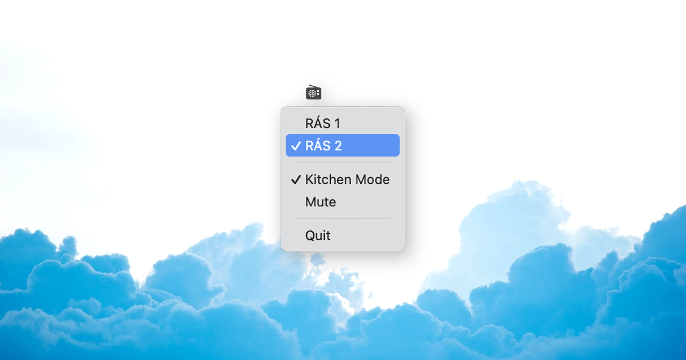

<p align="center">
  
</p>

<h1 align="center">RÚV Noise</h1>
<p align="center">Icelandic public radio through a simulated FM receiver in your menubar</p>

---

A tiny macOS menubar app that streams RÁS 1 and RÁS 2 with real-time audio processing. Great for background noise while you work.

## The Sound

Three modes — switch from the menubar:

### FM (default)

Broadcast FM radio simulation based on how FM reception actually works:

- **50μs de-emphasis** — the European FM warmth curve (corner at 3.2 kHz, −6 dB/octave)
- **15 kHz brick-wall LP** — FM broadcast bandwidth limit, kills digital air
- **Broadcast compression** — wideband Optimod-style density
- **Soft clipper** — broadcast limiter, subtle odd harmonics
- **FM-shaped noise** — differentiated white noise through de-emphasis (triangular spectrum hiss)
- **Multipath reflections** — two modulated delay taps (0.5 ms, 1.5 ms) with slow flutter
- **Stereo width reduction** — real FM has ~35 dB separation, not infinite
- **19 kHz pilot tone** — faint leakage at −50 dB, like a cheap receiver

### Kitchen

Radio in the other room — grandma's kitchen radio heard from the living room:

1. **Eldhús** — Mild tube saturation (cheap amp) + small kitchen reverb (6ms, gentle feedback)
2. **Doorway** — Low-pass at 2.5 kHz as sound passes through the door
3. **Stofa** — Larger living room reverb (20ms, subtle feedback), room color at 300 Hz
4. **Distance** — −4 dB attenuation, quiet room-tone noise

### Clean

Bypass all processing. Pure HLS stream for A/B comparison.

## Features

- Auto-tune for RÁS 1 news broadcasts (fetches schedule from RÚV GraphQL API)
- Measures actual HLS live latency for precise auto-play timing
- Tap active station to stop — no mute, no complexity

## Build & Run

Run without opening Xcode:

```
./run.sh
```

Builds with `xcodebuild` (ad-hoc signed) and launches the menubar app.

Or open in Xcode:

```
open RuvNoise.xcodeproj
# ⌘R to run, or:
xcodebuild -scheme RuvNoise -configuration Release
```

Requires macOS 14+ and Xcode 15+.

## Release

Releases are built, notarized, and attached to GitHub Releases automatically when you push a version tag.

### One-time setup

1. Create a **Developer ID Application** certificate — Xcode → Settings → Accounts → Manage Certificates → **+** → *Developer ID Application*. Export it as a `.p12` with a password.
2. Create an **App Store Connect API key** — [App Store Connect](https://appstoreconnect.apple.com) → Users and Access → Integrations → API keys. Note the *Key ID* and *Issuer ID*.
3. Add these repository secrets (Settings → Secrets and variables → Actions):

| Secret | Value |
|---|---|
| `MACOS_CERTIFICATE` | base64 of the `.p12` (`base64 < cert.p12 \| pbcopy`) |
| `MACOS_CERTIFICATE_PASSWORD` | the `.p12` password |
| `MACOS_KEYCHAIN_PASSWORD` | any password — used for a temporary keychain |
| `APPSTORE_CONNECT_API_KEY_ID` | the API key's *Key ID* (e.g. `H8RC4UN83P`) |
| `APPSTORE_CONNECT_API_KEY_ISSUER_ID` | the API key's *Issuer ID* |
| `APPSTORE_CONNECT_API_KEY` | base64 of the `.p8` (`base64 < AuthKey_XXX.p8 \| pbcopy`) |

### Cut a release

```
git tag v1.0.0
git push origin v1.0.0
```

The workflow signs with your Developer ID, notarizes with Apple, and attaches a `RuvNoise.dmg` (drag-to-Applications) to the release.

## Streams

| Station | URL |
|---------|-----|
| RÁS 1  | `https://ruv-radio-live.akamaized.net/streymi/ras1/ras1.m3u8` |
| RÁS 2  | `https://ruv-radio-live.akamaized.net/streymi/ras2/ras2.m3u8` |

## Tech

- Swift + SwiftUI `MenuBarExtra` (no dock icon)
- Manual HLS segment fetching + `AVAudioEngine` for real-time DSP
- 50μs IIR de-emphasis, 4th-order Butterworth LP, RMS compression, multipath delay lines
- `PlaybackState` enum state machine — single source of truth for UI
- Native macOS — no Electron, no dependencies
